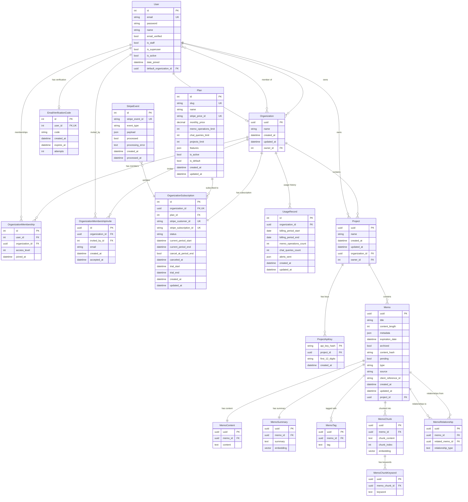

# Database Models Reference

Complete reference for all database models in the Skald system.

## Table of Contents

- [Organization Models](#organization-models)
- [Subscription Models](#subscription-models)
- [User Models](#user-models)
- [Project Models](#project-models)
- [Memo Models](#memo-models)
- [Model Relationships Diagram](#model-relationships-diagram)

---

## Organization Models

### Organization

**File:** `organization.py:7`

Represents a team or company that owns projects and has members.

#### Fields

| Field        | Type             | Description                                              |
| ------------ | ---------------- | -------------------------------------------------------- |
| `uuid`       | UUIDField        | Primary key, auto-generated UUID                         |
| `created_at` | DateTimeField    | Timestamp when organization was created (auto)           |
| `updated_at` | DateTimeField    | Timestamp of last update (auto)                          |
| `name`       | CharField(255)   | Organization name                                        |
| `owner`      | ForeignKey(User) | Organization owner (related_name: `owned_organizations`) |

#### Relationships

- **Owner**: Many-to-one with User (one user owns the organization)
- **Members**: Many-to-many with User through OrganizationMembership
- **Projects**: One-to-many with Project (related_name: `projects`)
- **Subscription**: One-to-one with OrganizationSubscription (related_name: `subscription`)

#### Properties

##### `current_plan` (property)

Returns the current subscription plan for this organization.

**Returns:** `Plan` object or `None`

**Implementation:** `organization.py:18`

```python
@property
def current_plan(self):
    """Returns the current plan for this organization"""
    try:
        return self.subscription.plan
    except Exception:
        from skald.models.plan import Plan
        try:
            return Plan.objects.get(is_default=True)
        except Plan.DoesNotExist:
            return None
```

**Behavior:**
- Returns plan from subscription if exists
- Falls back to default (free) plan if no subscription
- Returns None if no default plan configured

---

## Subscription Models

### Plan

**File:** `plan.py:4`

Defines subscription plan tiers and their limits. Stored in database (not hardcoded) to allow future plan changes without code deployment.

#### Fields

| Field                    | Type                 | Description                                         |
| ------------------------ | -------------------- | --------------------------------------------------- |
| `id`                     | AutoField            | Primary key                                         |
| `slug`                   | CharField(50)        | Stable identifier (e.g., 'free', 'basic', 'pro')    |
| `name`                   | CharField(100)       | Display name                                        |
| `stripe_price_id`        | CharField(255)       | Stripe Price ID (nullable for free/custom plans)    |
| `monthly_price`          | DecimalField(10, 2)  | Monthly price in USD (default: 0.00)                |
| `memo_operations_limit`  | IntegerField         | Max memo operations/month (null = unlimited)        |
| `chat_queries_limit`     | IntegerField         | Max chat queries/month (null = unlimited)           |
| `projects_limit`         | IntegerField         | Max projects (null = unlimited)                     |
| `features`               | JSONField            | Additional features (default: {})                   |
| `is_active`              | BooleanField         | Whether plan is available for selection             |
| `is_default`             | BooleanField         | Whether this is the default plan for new orgs       |
| `created_at`             | DateTimeField        | Plan creation timestamp (auto)                      |
| `updated_at`             | DateTimeField        | Last update timestamp (auto)                        |

#### Constraints

- `slug`: Unique
- `stripe_price_id`: Unique (nullable)

#### Meta Options

- **Ordering**: `["monthly_price"]` - Cheapest plans first

#### Features Field Structure

The `features` JSONField stores non-quantifiable plan features:

```json
{
  "search_type": "basic" | "advanced",
  "support_level": "community" | "email" | "priority" | "dedicated",
  "custom_embeddings": true | false,
  "self_hosted": true | false,
  "sla_guarantee": true | false
}
```

#### Default Plans

Four plans are created via fixtures:

1. **Free** ($0/month):
   - 1,000 memo operations/month
   - 100 chat queries/month
   - 1 project
   - Basic search, community support
   - `is_default=True`

2. **Basic** ($20/month):
   - 80,000 memo operations/month
   - 10,000 chat queries/month
   - 5 projects
   - Advanced search, email support

3. **Pro** ($250/month):
   - Unlimited memo operations
   - 100,000 chat queries/month
   - Unlimited projects
   - Advanced search, priority support

4. **Enterprise** (Custom pricing):
   - Unlimited everything
   - Custom embeddings, self-hosted option
   - Dedicated support, SLA guarantee

#### Usage Limits

- `null` values represent unlimited usage
- Limits are tracked at API endpoints via decorators
- Email alerts are sent at 80% and 100% usage thresholds
- Usage is **not blocked** when limits are exceeded
- Overage usage is charged at the end of the billing period
- See `decorators/usage_decorators.py` for tracking implementation

---

### OrganizationSubscription

**File:** `subscription.py:24`

Links an organization to a subscription plan. One subscription per organization.

#### Fields

| Field                    | Type                     | Description                                       |
| ------------------------ | ------------------------ | ------------------------------------------------- |
| `id`                     | AutoField                | Primary key                                       |
| `organization`           | OneToOneField(Org)       | Organization (related_name: `subscription`)       |
| `plan`                   | ForeignKey(Plan)         | Current plan (PROTECT on delete)                  |
| `scheduled_plan`         | ForeignKey(Plan)         | Plan scheduled for next period (nullable)         |
| `scheduled_change_date`  | DateTimeField            | When scheduled plan takes effect (nullable)       |
| `stripe_customer_id`     | CharField(255)           | Stripe Customer ID (nullable, unique)             |
| `stripe_subscription_id` | CharField(255)           | Stripe Subscription ID (nullable, unique)         |
| `status`                 | CharField(50)            | Subscription status (choices from enum)           |
| `current_period_start`   | DateTimeField            | Current billing period start                      |
| `current_period_end`     | DateTimeField            | Current billing period end                        |
| `cancel_at_period_end`   | BooleanField             | Whether subscription cancels at period end        |
| `canceled_at`            | DateTimeField            | Cancellation timestamp (nullable)                 |
| `trial_start`            | DateTimeField            | Trial period start (nullable)                     |
| `trial_end`              | DateTimeField            | Trial period end (nullable)                       |
| `created_at`             | DateTimeField            | Subscription creation timestamp (auto)            |
| `updated_at`             | DateTimeField            | Last update timestamp (auto)                      |

#### Status Choices

Defined by `SubscriptionStatus` enum:

| Status                  | Description                                      |
| ----------------------- | ------------------------------------------------ |
| `active`                | Subscription is active and valid                 |
| `past_due`              | Payment failed, awaiting retry                   |
| `canceled`              | Subscription has been canceled                   |
| `incomplete`            | Initial payment incomplete                       |
| `incomplete_expired`    | Initial payment incomplete and expired           |
| `trialing`              | In trial period                                  |
| `unpaid`                | Payment overdue                                  |

#### Indexes

- `stripe_customer_id`
- `stripe_subscription_id`
- `status`

#### Scheduled Plan Changes

The `scheduled_plan` and `scheduled_change_date` fields enable plan downgrades to be deferred until the end of the current billing period:

- **Upgrades**: Applied immediately (both `plan` field updated instantly)
- **Downgrades**: Scheduled for end of period (`scheduled_plan` populated, `plan` remains current)
- **Change date**: Set to `current_period_end` for downgrades
- **Execution**: Background job applies scheduled plan change when `scheduled_change_date` is reached

**Related Endpoints:**
- `POST /api/organization/{id}/subscription/change_plan` - Schedule plan change
- `POST /api/organization/{id}/subscription/cancel_scheduled_change` - Cancel scheduled change

#### Stripe Integration

- **Free plan users**: `stripe_customer_id` and `stripe_subscription_id` are null
- **Paid plans**: Stripe IDs are populated on checkout completion
- Status mirrors Stripe subscription status
- Updated via webhooks

#### Auto-Creation Signal

When a new organization is created, a subscription with the default (free) plan is automatically created:

**Signal:** `post_save` on `Organization`
**Handler:** `create_default_subscription()` in `subscription.py:109`

```python
@receiver(post_save, sender=Organization)
def create_default_subscription(sender, instance, created, **kwargs):
    if created:
        free_plan = Plan.objects.get(is_default=True)
        now = timezone.now()
        OrganizationSubscription.objects.create(
            organization=instance,
            plan=free_plan,
            status=SubscriptionStatus.ACTIVE,
            current_period_start=now,
            current_period_end=now + timedelta(days=30)
        )
```

---

### UsageRecord

**File:** `usage.py:6`

Tracks organization usage per billing period. Enables current usage display and historical reporting.

#### Fields

| Field                    | Type                     | Description                                           |
| ------------------------ | ------------------------ | ----------------------------------------------------- |
| `id`                     | AutoField                | Primary key                                           |
| `organization`           | ForeignKey(Organization) | Organization (related_name: `usage_records`)          |
| `billing_period_start`   | DateField                | Start date of billing period                          |
| `billing_period_end`     | DateField                | End date of billing period                            |
| `memo_operations_count`  | IntegerField             | Count of memo operations (default: 0)                 |
| `chat_queries_count`     | IntegerField             | Count of chat queries (default: 0)                    |
| `alerts_sent`            | JSONField                | Tracks which usage alerts have been sent (default: {}) |
| `created_at`             | DateTimeField            | Record creation timestamp (auto)                      |
| `updated_at`             | DateTimeField            | Last update timestamp (auto)                          |

#### Constraints

- **Unique Together**: (`organization`, `billing_period_start`) - One record per org per period

#### Indexes

- (`organization`, `billing_period_start`)
- `billing_period_start`

#### Meta Options

- **Ordering**: `["-billing_period_start"]` - Newest periods first

#### Properties

##### `projects_count` (property)

Computed property (not stored) that returns current project count.

**Returns:** `int`

**Implementation:** `usage.py:32`

```python
@property
def projects_count(self):
    """Compute current projects count (not stored)"""
    return self.organization.projects.count()
```

**Rationale:** Projects can be created/deleted independently, so count is computed real-time rather than stored.

#### Usage Tracking

- **Atomic Increments**: Usage counters are incremented atomically using F() expressions to prevent race conditions
- **Billing Period Lifecycle**: New record created at start of each billing period
- **Historical Data**: Previous periods preserved for usage history display

#### Usage Alerts

The `alerts_sent` JSONField tracks which usage alert emails have been sent for the current billing period:

**Structure:**
```json
{
  "memo_operations_80": true,
  "memo_operations_100": true,
  "chat_queries_80": true,
  "chat_queries_100": false,
  "projects_80": false
}
```

**Alert Thresholds:**
- `80`: Alert sent when usage reaches 80% of limit
- `100`: Alert sent when usage reaches or exceeds 100% of limit

**Behavior:**
- Alerts are sent only once per threshold per billing period
- Tracked flags prevent duplicate alert emails
- Flags reset automatically when new billing period starts (new UsageRecord created)
- See `services/usage_tracking_service.py` for alert logic

#### Increment Pattern

```python
from django.db.models import F

UsageRecord.objects.filter(pk=record.pk).update(
    memo_operations_count=F('memo_operations_count') + 1
)
```

---

### StripeEvent

**File:** `subscription.py:77`

Audit log of all Stripe webhook events. Prevents duplicate event processing and enables debugging.

#### Fields

| Field               | Type             | Description                                  |
| ------------------- | ---------------- | -------------------------------------------- |
| `id`                | AutoField        | Primary key                                  |
| `stripe_event_id`   | CharField(255)   | Stripe event ID (unique)                     |
| `event_type`        | CharField(100)   | Event type (e.g., 'customer.subscription.created') |
| `payload`           | JSONField        | Full event data from Stripe                  |
| `processed`         | BooleanField     | Whether event has been processed             |
| `processing_error`  | TextField        | Error message if processing failed (nullable)|
| `created_at`        | DateTimeField    | Event receipt timestamp (auto)               |
| `processed_at`      | DateTimeField    | Processing completion timestamp (nullable)   |

#### Constraints

- `stripe_event_id`: Unique

#### Indexes

- `stripe_event_id`
- (`event_type`, `processed`)

#### Meta Options

- **Ordering**: `["-created_at"]` - Newest events first

#### Idempotency Pattern

Before processing a webhook event, check if it already exists:

```python
if StripeEvent.objects.filter(stripe_event_id=event['id']).exists():
    return HttpResponse(status=200)  # Already processed

stripe_event = StripeEvent.objects.create(
    stripe_event_id=event['id'],
    event_type=event['type'],
    payload=event
)
```

This prevents duplicate processing when Stripe retries webhook delivery.

#### Tracked Events

Common event types stored:
- `customer.subscription.created`
- `customer.subscription.updated`
- `customer.subscription.deleted`
- `invoice.paid`
- `invoice.payment_failed`
- `checkout.session.completed`

#### Error Handling

If event processing fails:
1. Exception is caught
2. `processing_error` field populated with error message
3. `processed` remains `False`
4. Event can be manually reprocessed

---

## User Models

### User

**File:** `user.py:43`

Custom user model extending Django's AbstractUser. Uses email instead of username for authentication.

#### Fields

| Field                  | Type                     | Description                                                                  |
| ---------------------- | ------------------------ | ---------------------------------------------------------------------------- |
| `id`                   | AutoField                | Primary key (inherited)                                                      |
| `email`                | EmailField               | User's email address (unique, used for login)                                |
| `password`             | CharField                | Hashed password (inherited)                                                  |
| `first_name`           | CharField                | First name (inherited)                                                       |
| `last_name`            | CharField                | Last name (inherited)                                                        |
| `name`                 | CharField(255)           | Full name (blank allowed)                                                    |
| `is_staff`             | BooleanField             | Django admin access flag (inherited)                                         |
| `is_superuser`         | BooleanField             | Superuser flag (inherited)                                                   |
| `is_active`            | BooleanField             | Account active status (inherited)                                            |
| `date_joined`          | DateTimeField            | Account creation timestamp (inherited)                                       |
| `last_login`           | DateTimeField            | Last login timestamp (inherited)                                             |
| `default_organization` | ForeignKey(Organization) | Default organization (nullable)                                              |
| `current_project`      | ForeignKey(Project)      | Currently selected project (nullable, related_name: `current_project_users`) |
| `email_verified`       | BooleanField             | Email verification status (default: False)                                   |

#### Key Attributes

- `USERNAME_FIELD = "email"` - Uses email for authentication instead of username
- `username = None` - Username field is removed
- `REQUIRED_FIELDS = []` - No additional required fields beyond email and password
- `objects = UserManager()` - Custom user manager

#### Relationships

- **Default Organization**: Many-to-one with Organization (optional)
- **Current Project**: Many-to-one with Project (optional, related_name: `current_project_users`)
- **Owned Organizations**: One-to-many with Organization (related_name: `owned_organizations`)
- **Owned Projects**: One-to-many with Project (related_name: `owned_projects`)
- **Organization Memberships**: Many-to-many with Organization through OrganizationMembership

#### Notes

- Email verification can be disabled via `EMAIL_VERIFICATION_ENABLED` setting
- When email verification is disabled, accounts are automatically verified

---

### UserManager

**File:** `user.py:17`

Custom user manager for the User model. Extends Django's BaseUserManager.

#### Methods

##### `create_user(email, password=None, **extra_fields)`

Creates and saves a regular user.

**Parameters:**

- `email` (str): User's email address (required)
- `password` (str): User's password (optional)
- `**extra_fields`: Additional user fields

**Behavior:**

- Normalizes email address
- Auto-verifies email if `EMAIL_VERIFICATION_ENABLED = False`
- Hashes password before saving

##### `create_superuser(email, password=None, **extra_fields)`

Creates and saves a superuser with staff and admin privileges.

**Parameters:**

- `email` (str): Superuser's email address
- `password` (str): Superuser's password
- `**extra_fields`: Additional user fields

**Behavior:**

- Sets `is_staff=True` and `is_superuser=True`
- Validates that both flags are True
- Calls `create_user()` with superuser flags

---

### OrganizationMembership

**File:** `user.py:66`

Links users to organizations with role-based access control.

#### Fields

| Field          | Type                     | Description                                 |
| -------------- | ------------------------ | ------------------------------------------- |
| `id`           | AutoField                | Primary key                                 |
| `user`         | ForeignKey(User)         | Member user                                 |
| `organization` | ForeignKey(Organization) | Organization                                |
| `access_level` | IntegerField             | Role level (see OrganizationMembershipRole) |
| `joined_at`    | DateTimeField            | When user joined (auto)                     |

#### Constraints

- **Unique Together**: (`user`, `organization`) - One membership per user per organization

#### Default Values

- `access_level`: OrganizationMembershipRole.MEMBER (1)

---

### OrganizationMembershipRole

**File:** `user.py:10`

Enum defining organization access levels.

#### Values

| Role          | Value | Description                        |
| ------------- | ----- | ---------------------------------- |
| `MEMBER`      | 1     | Regular organization member        |
| `SUPER_ADMIN` | 19    | Administrative privileges          |
| `OWNER`       | 20    | Organization owner (highest level) |

#### Usage

```python
from skald.models.user import OrganizationMembershipRole

membership.access_level = OrganizationMembershipRole.SUPER_ADMIN
```

---

### OrganizationMembershipInvite

**File:** `user.py:76`

Manages invitations to join organizations.

#### Fields

| Field          | Type                     | Description                             |
| -------------- | ------------------------ | --------------------------------------- |
| `id`           | UUIDField                | Primary key, auto-generated UUID        |
| `organization` | ForeignKey(Organization) | Target organization                     |
| `invited_by`   | ForeignKey(User)         | User who sent the invitation            |
| `email`        | EmailField               | Invitee's email address                 |
| `created_at`   | DateTimeField            | Invitation creation timestamp (auto)    |
| `accepted_at`  | DateTimeField            | When invitation was accepted (nullable) |

#### Constraints

- **Unique Together**: (`organization`, `email`) - One pending invite per email per organization

#### Workflow

1. User with appropriate permissions creates invite
2. Email is sent to invitee
3. Invitee accepts (sets `accepted_at`)
4. OrganizationMembership is created

---

### EmailVerificationCode

**File:** `user.py:88`

Manages email verification codes for user registration.

#### Fields

| Field        | Type             | Description                                  |
| ------------ | ---------------- | -------------------------------------------- |
| `id`         | AutoField        | Primary key                                  |
| `user`       | ForeignKey(User) | User to verify (unique)                      |
| `code`       | CharField(6)     | 6-character verification code                |
| `created_at` | DateTimeField    | Code creation timestamp (auto)               |
| `expires_at` | DateTimeField    | Code expiration time                         |
| `attempts`   | IntegerField     | Number of verification attempts (default: 0) |

#### Indexes

- Index on `code` field for fast lookups

#### Notes

- `user` field has `unique=True` constraint - one active code per user
- Consider converting to OneToOneField (TODO in code)

---

## Project Models

### Project

**File:** `project.py:9`

Represents a project within an organization. Projects scope memos and API keys.

#### Fields

| Field          | Type                     | Description                                    |
| -------------- | ------------------------ | ---------------------------------------------- |
| `uuid`         | UUIDField                | Primary key, auto-generated UUID               |
| `created_at`   | DateTimeField            | Project creation timestamp (auto)              |
| `updated_at`   | DateTimeField            | Last update timestamp (auto)                   |
| `name`         | CharField(255)           | Project name                                   |
| `organization` | ForeignKey(Organization) | Parent organization (related_name: `projects`) |
| `owner`        | ForeignKey(User)         | Project owner (related_name: `owned_projects`) |

#### Properties

##### `has_api_key` (property)

Returns whether the project has at least one API key.

**Returns:** `bool`

**Implementation:** `project.py:32`

```python
@property
def has_api_key(self):
    return ProjectApiKey.objects.filter(project=self).exists()
```

#### Methods

##### `__str__()`

Returns string representation of the project.

**Returns:** `"{name} ({organization_name})"`

**Example:** `"My Project (Acme Corp)"`

#### Meta Options

- **Ordering**: `["-created_at"]` - Newest projects first

#### Relationships

- **Organization**: Many-to-one with Organization
- **Owner**: Many-to-one with User
- **Memos**: One-to-many with Memo (related_name: `memos`)
- **API Keys**: One-to-many with ProjectApiKey

---

### ProjectApiKey

**File:** `project.py:36`

Stores hashed API keys for project authentication.

#### Fields

| Field             | Type                | Description                          |
| ----------------- | ------------------- | ------------------------------------ |
| `api_key_hash`    | CharField(255)      | Primary key, hashed API key (unique) |
| `project`         | ForeignKey(Project) | Associated project                   |
| `first_12_digits` | CharField(12)       | First 12 characters for display      |
| `created_at`      | DateTimeField       | Key creation timestamp (auto)        |

#### Methods

##### `__str__()`

Returns string representation of the API key.

**Returns:** `"{project_name} - {api_key_hash}"`

#### Security Notes

- API keys are stored hashed (not plaintext)
- `first_12_digits` allows users to identify keys without exposing full value
- Hash is used as primary key (guaranteed unique)

---

## Memo Models

### Memo

**File:** `memo.py:9`

Main model representing a piece of knowledge/content in the system.

#### Fields

| Field                 | Type                | Description                                        |
| --------------------- | ------------------- | -------------------------------------------------- |
| `uuid`                | UUIDField           | Primary key, auto-generated UUID                   |
| `created_at`          | DateTimeField       | Memo creation timestamp (auto)                     |
| `updated_at`          | DateTimeField       | Last update timestamp (auto)                       |
| `title`               | CharField(255)      | Memo title                                         |
| `content_length`      | IntegerField        | Length of content in characters                    |
| `metadata`            | JSONField           | Flexible metadata storage (default: {})            |
| `expiration_date`     | DateTimeField       | Optional expiration date (nullable)                |
| `archived`            | BooleanField        | Archive status (default: False)                    |
| `content_hash`        | CharField(255)      | Hash of content for deduplication                  |
| `pending`             | BooleanField        | Processing status (default: True)                  |
| `type`                | CharField(255)      | Content type (e.g., "code", "document") (nullable) |
| `source`              | CharField(255)      | Content source (URL, filename, etc.) (nullable)    |
| `client_reference_id` | CharField(255)      | External system reference ID (nullable)            |
| `project`             | ForeignKey(Project) | Parent project (related_name: `memos`)             |

#### Properties

##### `content` (property)

Returns the full content of the memo.

**Returns:** `str`

**Implementation:** `memo.py:38`

```python
@property
def content(self) -> str:
    return MemoContent.objects.get(memo=self).content
```

**Note:** Content is stored separately in MemoContent for performance optimization.

##### `summary` (property)

Returns the AI-generated summary of the memo.

**Returns:** `str`

**Implementation:** `memo.py:42`

```python
@property
def summary(self) -> str:
    return MemoSummary.objects.get(memo=self).summary
```

#### Relationships

- **Project**: Many-to-one with Project
- **Content**: One-to-one with MemoContent
- **Summary**: One-to-one with MemoSummary
- **Tags**: One-to-many with MemoTag
- **Chunks**: One-to-many with MemoChunk
- **Related Memos**: Many-to-many with Memo through MemoRelationship

#### Workflow States

The `pending` field tracks processing status:

- `True`: Memo is being processed (chunking, embedding generation, summarization)
- `False`: Memo is fully processed and searchable

---

### MemoContent

**File:** `memo.py:54`

Stores the full content of a memo in a separate table for performance.

#### Fields

| Field     | Type             | Description                          |
| --------- | ---------------- | ------------------------------------ |
| `uuid`    | UUIDField        | Primary key, auto-generated UUID     |
| `memo`    | ForeignKey(Memo) | Parent memo                          |
| `content` | TextField        | Full memo content (unlimited length) |

#### Design Rationale

Content is separated from the main Memo model to:

- Improve query performance when content isn't needed
- Reduce table size for index operations
- Allow efficient pagination of memo lists

---

### MemoSummary

**File:** `memo.py:47`

Stores AI-generated summaries and their vector embeddings.

#### Fields

| Field       | Type              | Description                       |
| ----------- | ----------------- | --------------------------------- |
| `uuid`      | UUIDField         | Primary key, auto-generated UUID  |
| `memo`      | ForeignKey(Memo)  | Parent memo                       |
| `summary`   | TextField         | AI-generated summary text         |
| `embedding` | VectorField(2048) | 2048-dimensional vector embedding |

#### Vector Search

The `embedding` field enables semantic search:

- Generated using Voyage AI
- 2048 dimensions
- Uses pgvector for efficient similarity search
- See `vector_search.py:45` for search implementation

---

### MemoTag

**File:** `memo.py:60`

Associates tags with memos for categorization and filtering.

#### Fields

| Field  | Type             | Description                      |
| ------ | ---------------- | -------------------------------- |
| `uuid` | UUIDField        | Primary key, auto-generated UUID |
| `memo` | ForeignKey(Memo) | Tagged memo                      |
| `tag`  | TextField        | Tag text                         |

#### Usage

Tags enable:

- Categorization of memos
- Filtering in search queries
- Organizing knowledge base by topic/project/category

**Example:**

```python
# Add tags to a memo
MemoTag.objects.create(memo=memo, tag="python")
MemoTag.objects.create(memo=memo, tag="machine-learning")
```

---

### MemoRelationship

**File:** `memo.py:66`

Defines directed relationships between memos.

#### Fields

| Field               | Type             | Description                                      |
| ------------------- | ---------------- | ------------------------------------------------ |
| `uuid`              | UUIDField        | Primary key, auto-generated UUID                 |
| `memo`              | ForeignKey(Memo) | Source memo (related_name: `relationships_from`) |
| `related_memo`      | ForeignKey(Memo) | Target memo (related_name: `relationships_to`)   |
| `relationship_type` | TextField        | Type of relationship                             |

#### Relationship Types

Common relationship types (examples):

- `"references"` - Memo A references Memo B
- `"supersedes"` - Memo A supersedes/replaces Memo B
- `"related_to"` - General relation
- `"part_of"` - Memo A is part of Memo B

#### Direction

Relationships are directional:

- `memo` � `related_memo` represents one direction
- To create bidirectional, create two relationships

**Example:**

```python
# "Meeting Notes" references "Project Spec"
MemoRelationship.objects.create(
    memo=meeting_memo,
    related_memo=spec_memo,
    relationship_type="references"
)
```

---

### MemoChunk

**File:** `memo.py:77`

Stores content chunks with vector embeddings for granular semantic search.

#### Fields

| Field           | Type              | Description                                |
| --------------- | ----------------- | ------------------------------------------ |
| `uuid`          | UUIDField         | Primary key, auto-generated UUID           |
| `memo`          | ForeignKey(Memo)  | Parent memo                                |
| `chunk_content` | TextField         | Content of this chunk                      |
| `chunk_index`   | IntegerField      | Position in sequence of chunks (0-indexed) |
| `embedding`     | VectorField(2048) | 2048-dimensional vector embedding          |

#### Chunking Strategy

Memos are split into chunks to:

- Enable finding specific passages within large documents
- Improve search precision (vs searching entire documents)
- Provide context snippets in search results

#### Vector Search

- Each chunk has its own embedding
- Enables searching at passage-level granularity
- See `vector_search.py:18` for chunk search implementation

**Example Workflow:**

1. Large memo is ingested
2. Content is split into logical chunks
3. Each chunk is embedded using Voyage AI
4. Chunks are stored with embeddings
5. Search finds most relevant chunks, returns parent memo

---

### MemoChunkKeyword

**File:** `memo.py:85`

Stores extracted keywords from memo chunks.

#### Fields

| Field        | Type                  | Description                      |
| ------------ | --------------------- | -------------------------------- |
| `uuid`       | UUIDField             | Primary key, auto-generated UUID |
| `memo_chunk` | ForeignKey(MemoChunk) | Parent chunk                     |
| `keyword`    | TextField             | Extracted keyword                |

#### Use Cases

Keywords can be used for:

- Traditional keyword-based search
- Tag cloud generation
- Content analysis and categorization
- Hybrid search (combining keywords + vector search)

---

## Model Relationships Diagram



## Key Design Patterns

### 1. UUID Primary Keys

Most models use UUID primary keys for:

- Distributed system compatibility
- Security (non-sequential IDs)
- Easy merging of data from multiple sources

**Exception:** User model uses auto-incrementing integer ID (Django default)

### 2. Timestamp Tracking

Most models include:

- `created_at` - Auto-set on creation
- `updated_at` - Auto-updated on modification

### 3. Soft Deletion

The `Memo.archived` field enables soft deletion:

- Memos aren't physically deleted
- Archived memos can be filtered out or restored

### 4. Content Separation

Large text fields are separated:

- `Memo` stores metadata only
- `MemoContent` stores full content
- `MemoSummary` stores summary + embedding

This improves query performance when content isn't needed.

### 5. Vector Embeddings

Vector fields use pgvector extension:

- 2048 dimensions (Voyage AI embeddings)
- Enables semantic similarity search
- Cosine distance for similarity calculation

### 6. Hierarchical Scoping

Data is scoped hierarchically:

```
Organization � Project � Memo
```

This enables:

- Multi-tenancy
- Access control
- Data isolation

### 7. Flexible Metadata

`Memo.metadata` JSON field allows:

- Client-specific data storage
- No schema changes needed
- Queryable using PostgreSQL JSON operators

## Related Files

- `skald/models/organization.py` - Organization model
- `skald/models/plan.py` - Subscription plan model
- `skald/models/subscription.py` - OrganizationSubscription and StripeEvent models
- `skald/models/usage.py` - Usage tracking model
- `skald/models/user.py` - User, membership, and authentication models
- `skald/models/project.py` - Project and API key models
- `skald/models/memo.py` - Memo and related content models
- `skald/embeddings/vector_search.py` - Vector search queries
- `skald/embeddings/generate_embedding.py` - Embedding generation
- `skald/fixtures/plans.json` - Default plan fixtures
